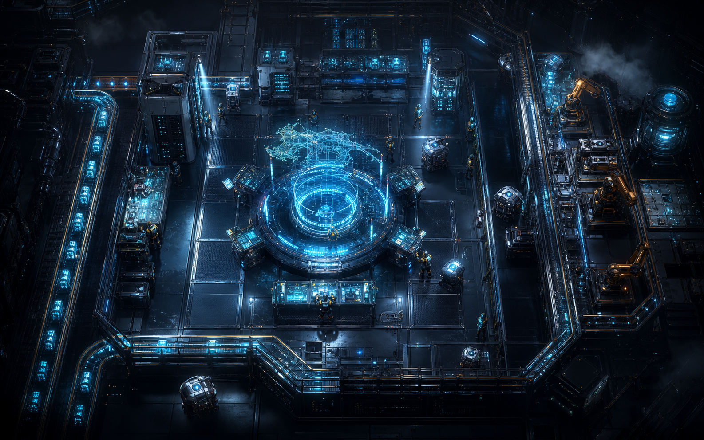
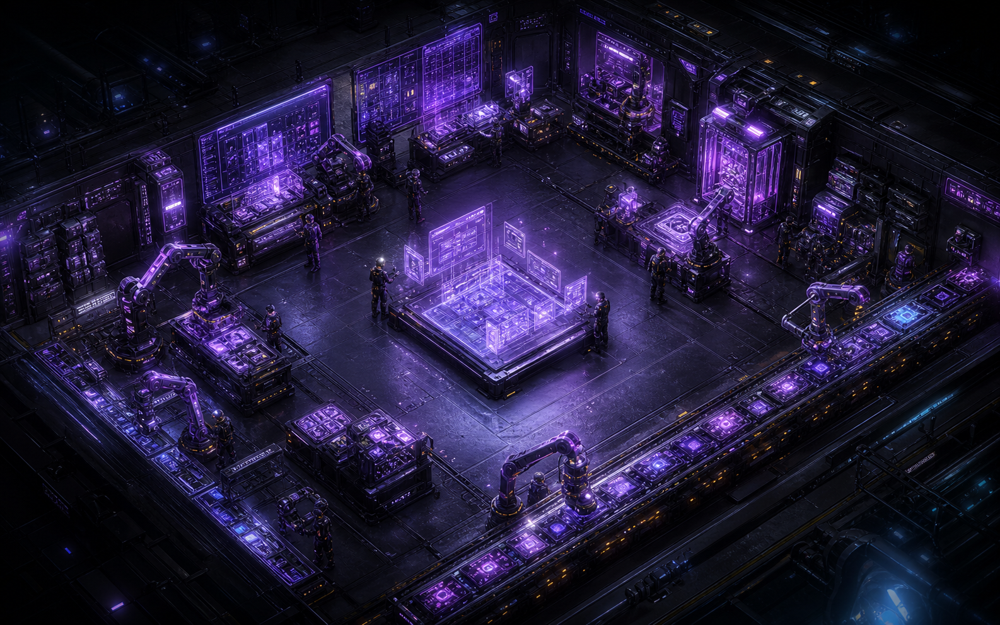
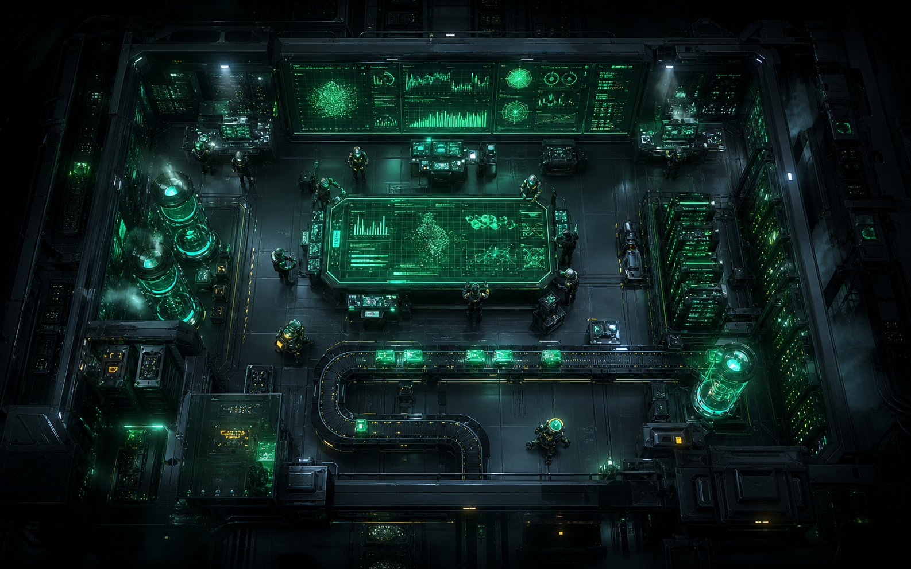
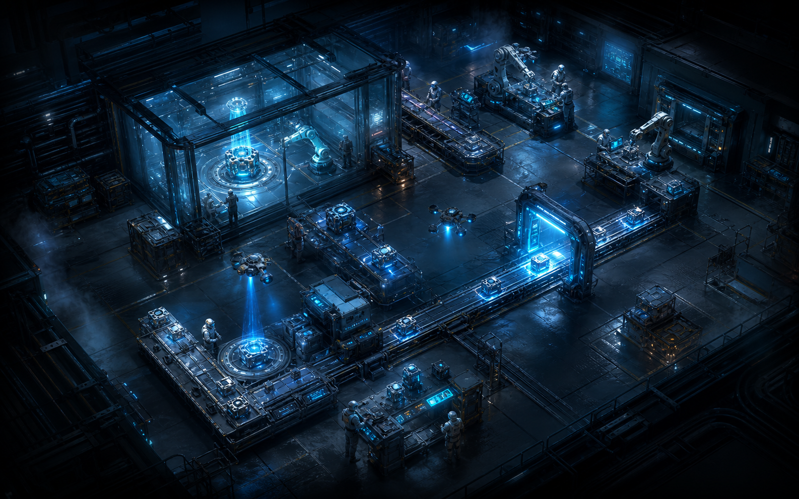
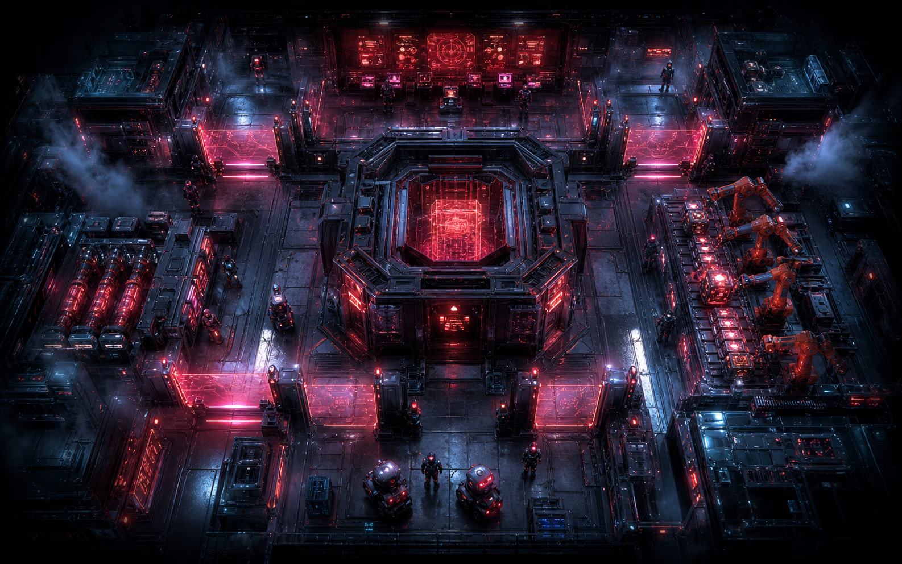
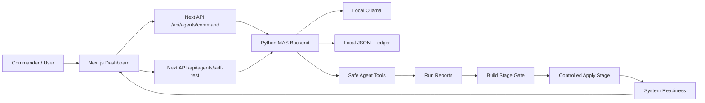
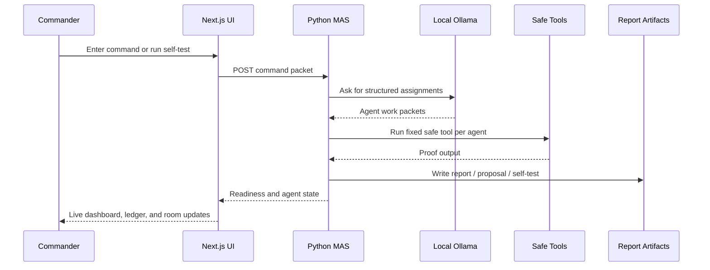

# Nexus MAS Commander

A local-first multi-agent command dashboard built with **Next.js**, **Tailwind CSS**, **React Flow**, **Python**, and **Ollama**.

Nexus MAS turns a local LLM into a sci-fi “Commander Center” where multiple specialist agents receive work packets, run safe local verification tools, write proof into a ledger, and report system readiness back to the UI.

## Preview

The dashboard uses a dark cyberpunk interface with glass panels, neon room borders, a live commander sidebar, execution ledger panels, realistic agent factory rooms, and an animated graph view for agent communication.

| Researcher | Designer | Analyst |
| --- | --- | --- |
|  |  |  |

| Builder | QA Sentinel | Security |
| --- | --- | --- |
|  |  |  |


## What We Built

- **Commander Center UI**: dark dashboard shell with live system metrics, agent roster, current tasks, progress bars, status indicators, and command input.
- **Agent Factory Floor**: six production rooms with realistic sci-fi room imagery, glass overlays, neon borders, task chips, progress bars, and terminal-style proof logs.
- **Graph View**: React Flow communication graph with a central Commander node, circular agent nodes, and animated data-transfer edges.
- **Local Python MAS**: standard-library Python service that receives commands, asks local Ollama for work packets, dispatches agents, stores JSONL ledger events, and exposes health/state/report APIs.
- **Safe Tool Layer**: agents do not execute arbitrary prompt-to-shell commands. Each agent is mapped to a fixed local verification tool.
- **Run Reports**: each command produces a report artifact with agent checks, tool proof, outputs, and next-step guidance.
- **Build Gate**: verified run reports can create and approve a controlled build-stage proposal.
- **Apply Stage**: approved plans can apply a controlled generated source artifact and verify Python compile, TypeScript noEmit, and endpoint health.
- **Commander Self-Test**: one-click end-to-end self-test from the UI that verifies the local MAS pipeline and stores a self-test artifact.
- **GitHub CI**: public repository validation with TypeScript, Python compile, and Next.js production build.

## Architecture



## Agent Workflow



## Safe Agent Tools

| Agent | Tool | Proof |
| --- | --- | --- |
| Researcher | `repo_scan` | Counts workspace files, React components, API routes, and visual assets |
| Designer | `visual_asset_audit` | Verifies all six realistic room images exist |
| Analyst | `ledger_metrics` | Measures event counts for the current run |
| Builder | `typecheck` | Runs TypeScript noEmit |
| QA Sentinel | `endpoint_smoke` | Checks Python MAS and Ollama endpoints |
| Security | `local_safety_audit` | Confirms localhost-only execution boundaries |

## Local Setup

Requirements:

- Node.js 22+ recommended
- Python 3.11+
- Ollama running locally at `http://localhost:11434`
- An installed local model, for example `qwen2.5-coder:latest`

Install dependencies:

```powershell
npm.cmd install
```

Copy environment defaults if needed:

```powershell
copy .env.example .env.local
```

Default environment:

```text
OLLAMA_HOST=http://localhost:11434
OLLAMA_MODEL=qwen2.5-coder:latest
PYTHON_MAS_URL=http://127.0.0.1:5055
```

If you want to use another local model, update `.env.local`:

```text
OLLAMA_MODEL=hermes
```

## Run Locally

Use two terminals.

Terminal 1, Python MAS backend:

```powershell
npm.cmd run dev:backend
```

or:

```powershell
powershell -ExecutionPolicy Bypass -File .\scripts\start-mas-backend.ps1
```

Terminal 2, Next.js dashboard:

```powershell
npm.cmd run dev:dashboard
```

Open:

```text
http://localhost:3009
```

## Verify Everything

Run local checks:

```powershell
npm.cmd run typecheck
npm.cmd run check:backend
npm.cmd run build
```

Runtime health checks:

```powershell
curl.exe http://localhost:3009/api/system/telemetry
curl.exe http://localhost:3009/api/agents/readiness
curl.exe http://127.0.0.1:5055/health
```

End-to-end MAS self-test:

```powershell
curl.exe -X POST -H "Content-Type: application/json" --data-raw "{}" http://localhost:3009/api/agents/self-test
```

Expected self-test result:

```text
status: passed
python_mas_command: 6/6 agent tool checks passed
build_stage_gate: approved
apply_stage_verification: applied
system_readiness: ready
```

## Runtime Artifacts

Local execution memory is written to:

```text
backend/data/
```

That directory is intentionally ignored by Git. It can contain local command history, run reports, self-test artifacts, and generated apply-stage data. These files are useful on your machine but should not be committed to a public repository.

Also ignored:

- `.next/`
- `node_modules/`
- local logs
- `.env.local`
- `lib/generated/`

## Public Safety Notes

This repository is safe for public source release because it does not include:

- private `.env` files
- local runtime ledgers
- local generated run artifacts
- model outputs from private commands
- arbitrary command execution credentials

The Python MAS deliberately uses a fixed safe-tool registry. Natural-language prompts can dispatch the six local agent tools, but they cannot directly run arbitrary shell commands.

## Production Build

```powershell
npm.cmd run build
npm.cmd run serve:dashboard
```

Production dashboard server:

```text
http://localhost:3010
```

The Python MAS backend still runs separately on:

```text
http://127.0.0.1:5055
```

## Project Structure

```text
app/                         Next.js app routes and API proxies
components/                  Dashboard, factory, graph, ledger, and stage panels
lib/                         Agent definitions, command types, telemetry helpers
backend/                     Standard-library Python MAS backend
public/assets/               Factory backdrop and realistic agent room images
scripts/                     Windows helper scripts for local startup
.github/workflows/ci.yml     GitHub validation workflow
```

## Current Status

Validated locally on June 7, 2026:

- Next.js production build passed
- TypeScript noEmit passed
- Python backend compile passed
- Ollama telemetry online
- Python MAS health online
- Full MAS self-test passed through the Next.js API

Nexus MAS is ready for controlled local feature work and public GitHub release.
